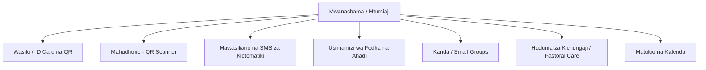

# 📘 MWONGOZO MKUU WA MFUMO (MASTER SYSTEM DOCUMENTATION)
## Mfumo wa Usimamizi wa Kanisa la Manzese SDA (Church Management System)

Nyaraka hizi zinatoa maelezo ya kina ya kiufundi na kiutendaji kwa ajili ya vipengele vyote (modules) vya Mfumo wa Usimamizi wa Kanisa la Manzese SDA. Mwongozo huu umeandaliwa ili kurahisisha uendeshaji, usimamizi, na uendelezaji wa mfumo baada ya kuanza kufanya kazi rasmi (Go-Live).

---

## 🛠️ 1. Usanifu wa Mfumo na Teknolojia (System Architecture & Tech Stack)

Mfumo umejengwa kwa kutumia teknolojia za kisasa, thabiti na salama za wavuti:

*   **Lugha Kuu ya Backend:** PHP ^8.2
*   **Framework ya Backend:** Laravel 11.31 (Inayotumia muundo wa MVC - Model-View-Controller)
*   **Lugha ya Frontend:** HTML5, CSS3, JavaScript (ES6)
*   **CSS Framework:** Bootstrap 4/5 (AdminLTE 3 Dashboard Template)
*   **Dynamic Components:** Livewire 3 (Kwa ajili ya QR Attendance Scanner inayofanya kazi bila kupakia upya ukurasa - SPA feel)
*   **Database:** SQLite / MySQL (Inategemea na usanidi wa faili la `.env` kwenye server)
*   **Usimamizi wa Ruhusa:** Spatie Laravel-Permission (Kwa ajili ya kudhibiti nani anaona nini)
*   **Uwekaji wa Kumbukumbu za Matendo:** Spatie Laravel-Activitylog (Kurekodi matendo yote ya kiutawala)

---

## 🗂️ 2. Vipengele Vikuu vya Mfumo (Core Modules & Features)



### 🔑 A. Uthibitishaji na Ulinzi (Authentication & User Access)
*   **Ukurasa wa Kuingia (Login):** Mfumo unalindwa na ukurasa wa Login wenye ulinzi wa kujaribu kuingia (throttle: 5 attempts per minute) ili kuzuia mashambulizi ya kidukuzi.
*   **Forgot Password Flow (Self-Service):** Mtumiaji anayejua email yake anaweza kujirudishia password kwa kutumia kiungo salama kinachotumwa kwenye email yake (SMTP-configured). Ina ulinzi dhidi ya hitilafu za SMTP ili kuzuia system crash.
*   **Change Password Form (Dedicated & Secure):** Ukurasa maalum wa kubadilisha password ambao unalazimisha mtumiaji kuweka password ya sasa (zamani) ndipo mfumo umruhusu kuweka password mpya. Hii inazuia watu wasio waaminifu kubadilisha nenosiri kama akaunti ikiachwa wazi.
*   **Usimamizi wa Majukumu (Role Management):** Majukumu yaliyopo ni:
    *   `super_admin` - Mamlaka yote kwenye mfumo.
    *   `admin` - Usimamizi wa kanisa, wanachama na matukio.
    *   `pastor` - Usimamizi wa kiroho, ripoti, na huduma za kichungaji.
    *   `financial_officer` - Kurekodi na kudhibiti fedha, zaka, sadaka, na ahadi.
    *   `member` - Kupata wasifu, kadi ya ID, kutoa ahadi, na kufanya malipo ya mtandaoni.

### 📇 B. Wasifu wa Mwanachama na Kadi ya ID (Member Profile & ID Cards)
*   **Wasifu wa Mwanachama (Profile):** Unabeba taarifa za kina kama:
    *   *Taarifa Binafsi:* Jina kamili, jinsia, tarehe ya kuzaliwa, hali ya ndoa (marital status), tarehe ya harusi, na picha ya wasifu.
    *   *Mawasiliano:* Email, namba ya simu, na anwani.
    *   *Safari ya Kiroho:* Tarehe ya wokovu (salvation), tarehe ya ubatizo.
    *   *Mawasiliano ya Dharura:* Jina la mtu wa karibu na namba yake ya simu.
*   **Kadi ya ID yenye QR Code:** Mfumo unazalisha kadi ya ID ya mwanachama yenye QR Code inayobeba kiungo cha moja kwa moja cha kurekodi mahudhurio (k.m. `/attendance/scan-qr/MEM-12345`). Kadi hii inaweza kupakuliwa kama PDF au kuchapishwa (printed).

### 🎛️ C. Mfumo wa Mahudhurio wa QR (QR Attendance Scanning)
*   **Livewire QR Scanner:** Ukurasa wa skana unaotumia kamera ya kifaa (simu/kompyuta) kuskani kadi za ID za wanachama papo hapo.
*   **Scanning Flow:**
    1.  Mhudumu (Usher) anaskani QR Code kwenye kadi ya mwanachama.
    2.  Kama mhudumu hajaingia kwenye mfumo, ukurasa unamletea **Inline Login Form** hapo hapo ili kuzuia mkatiko wa redirect.
    3.  Mhudumu akishaingia, mfumo unakariri ibada ya leo (session cache) na kurekodi mahudhurio ya mwanachama mara moja bila kuhitaji kubonyeza vitufe vingi.
*   **Responsive Layout:** Orodha ya matukio na mahudhurio inaweza kusogezwa upande (horizontal scroll) kwenye skrini ndogo za simu ili kuzuia kufichika kwa vitufe vya matendo (Actions).

### 💬 D. Mawasiliano na SMS za Kiotomatiki (SMS Gateway)
*   **SimpApp Android SMS Gateway API:** Mfumo umeunganishwa na App ya simu ya Android inayoruhusu kutuma ujumbe kwa bei ya kawaida ya kifurushi cha simu ya kanisa.
*   **Uthibitishaji wa Namba za Simu:** Namba zote za simu zilizowekwa kwa mtindo wa kienyeji (k.m. `0786...` au `2557...`) zinasafishwa na kubadilishwa kuwa mtindo rasmi wa kimataifa wa E.164 (k.m. `+255786...`) kabla ya kutumwa.
*   **SMS za Kiotomatiki (Auto-Triggers):**
    *   *Mgeni Mpya (Visitor Welcome):* Mgeni mpya akirekodiwa, anapokea ujumbe wa kumkaribisha mara moja.
    *   *Stakabadhi ya Michango (Contribution Receipts):* Zaka au Sadaka ikirekodiwa, mwanachama anapata SMS ya thibitisho ya kiasi alichotoa kiotomatiki.
*   **Mjumbe Mkuu (Bulk SMS):** Viongozi wanaweza kuandika na kutuma mialiko ya ibada au mikutano kwa kundi logo la washiriki moja kwa moja.

### 💰 E. Usimamizi wa Fedha na Ahadi (Financials & Pledges)
*   **Miamala ya Kifedha (Transactions):** Usimamizi wa Mapato (Income) na Matumizi (Expense) ya kanisa.
*   **Uthibitishaji wa Malipo ya Ahadi (Pledge Security):**
    *   *Viongozi:* Ma-Admin na Ma-Treasurer pekee ndio wenye ruhusa ya kurekodi malipo ya mkono (Cash, manual MPesa, check).
    *   *Waumini:* Waumini wa kawaida wamezuiliwa kurekodi malipo ya mkono ila wanapewa maelekezo na kiungo cha kufanya malipo ya uhakika ya mtandaoni (Online Giving).
*   **Online Giving (Pesapal Integration):** Waumini wanaweza kutoa michango yao au kulipia ahadi kupitia kadi za benki (Visa/Mastercard) au mitandao ya simu (M-Pesa, Tigo Pesa, Airtel Money) kupitia mfumo wa Pesapal v3.

### 👥 F. Kanda / Vikundi Vidogo (Small Groups / Home Cells)
*   Vikundi vidogo vya kanisa (Kanda) vinaratibiwa kupitia mfumo huu.
*   **Mahudhurio ya Kanda:** Kiongozi wa kanda anaweza kurekodi mahudhurio ya kikundi chake kila wiki.
*   **Weekly Reporting (Ripoti za Wiki):** Viongozi wa kanda wanajaza ripoti za masomo, maswali ya wiki, mahudhurio na hali ya kiroho.
*   **Finance:** Uwekaji wa sadaka za kanda na malipo ya sadaka kwenda kanisa kuu.
*   **Reminders:** Mfumo una uwezo wa kutuma SMS za vikumbuzi kwa viongozi ambao hawajawasilisha ripoti za wiki au sadaka.

### 🏥 G. Huduma za Kichungaji na Wageni (Pastoral Care & Visitors)
*   **Wageni (Visitor Tracking):** Kusajili wageni wote wanaotembelea kanisa, kurekodi jinsi walivyopata taarifa za kanisa, na kuwagawa kwa waumini maalum kwa ajili ya ufuatiliaji (Follow-up).
*   **Ziara za Kichungaji (Visits):** Kurekodi kumbukumbu za ziara za kichungaji zilizofanywa kwa waumini (visiting sick, counseling, n.k.).
*   **Care Requests:** Mfumo unaoruhusu mwanachama yeyote kuomba msaada wa kichungaji au kiroho (k.m. kuombewa, kutembelewa akiwa mgonjwa). Viongozi wanapokea maombi haya kwenye jopo lao la uongozi na kuyajibu.

### 📅 H. Vipengele Vingine (Other Modules)
*   **Matangazo (Announcements):** Matangazo ya kanisa yanayowekwa na admin na kuonekana kwenye dashboard ya kila mwanachama.
*   **Roster (Zamu za Huduma):** Kupanga na kuonyesha zamu za huduma (k.m. Nani anahubiri, nani anasoma somo, usafi, n.k.) kwa kila Sabato.
*   **Maktaba (Library):** Usimamizi wa vitabu (hasa vya Roho ya Unabii) vinavyomilikiwa na kanisa.
*   **Prayer Wall (Ukuta wa Maombi):** Mahali pa kuweka maombi ya kanisa ambapo waumini wanaweza kuona na kubonyeza "Pray" ili kuonyesha wanawaombea, na kuweka alama ya "Answered" pale maombi yanapojibiwa.
*   **Assets (Mali za Kanisa):** Orodha na usimamizi wa mali zote za kanisa (vifaa vya mziki, viti, ardhi, n.k.).

---

## 🗄️ 3. Uhusiano wa Database na Models (Database Relationships)

Kila Model kwenye mfumo imeunganishwa kwa usahihi ili kuhakikisha uadilifu wa data (data integrity):

| Model ya Chanzo | Model ya Lengo | Aina ya Uhusiano | Matumizi |
| :--- | :--- | :--- | :--- |
| `User` | `Member` | `hasOne` | Kila mtumiaji anayeingia ana wasifu mmoja wa mwanachama. |
| `Member` | `Department` | `belongsToMany` | Mwanachama anaweza kuwa katika idara nyingi (k.m. Kwaya na Vijana). |
| `Member` | `SmallGroup` | `belongsToMany` | Mwanachama anakuwa kwenye kundi moja la Kanda. |
| `Pledge` | `PledgePayment` | `hasMany` | Ahadi moja inaweza kulipiwa kwa awamu nyingi. |
| `Transaction` | `Contribution` | `hasOne` | Kila mchango wa kifedha unazalisha muamala mmoja kwenye hesabu za fedha. |
| `Visitor` | `Member` | `belongsTo` | Mgeni anapangiwa mshiriki mmoja wa kumfuatilia (Assigned Follow-up). |
| `Event` | `Attendance` | `hasMany` | Tukio moja linabeba orodha ya mahudhurio ya washiriki wote. |

---

## 🌐 4. Kuweka Mfumo Kazi na Faili la `.env` (Deployment & Setup)

Unapoweka mfumo huu kwenye VPS (kwa kutumia aaPanel), faili la **`.env`** linapaswa kuwa na usanidi sahihi kama ifuatavyo:

### Usanidi wa Barua Pepe (cPanel Secure SSL/TLS)
```env
MAIL_MAILER=smtp
MAIL_HOST=mail.manzesesdachurch.org
MAIL_PORT=465
MAIL_USERNAME=no-reply@manzesesdachurch.org
MAIL_PASSWORD="weka_password_ya_email_hapa"
MAIL_ENCRYPTION=ssl
MAIL_FROM_ADDRESS="no-reply@manzesesdachurch.org"
MAIL_FROM_NAME="Manzese SDA Church"
```

### Usanidi wa SMS Gateway (SimpApp Android App)
```env
SMS_GATEWAY_API_KEY="weka_api_key_uliyopewa_na_app_hapa"
```

### Usanidi wa Online Giving (Pesapal v3 API)
```env
PESAPAL_CONSUMER_KEY="weka_key_ya_pesapal_hapa"
# Weka 'production' kwa miamala halisi au 'sandbox' kwa ajili ya majaribio
PESAPAL_ENV=production
PESAPAL_CONSUMER_SECRET="weka_secret_ya_pesapal_hapa"
PESAPAL_IPN_ID="weka_ipn_id_iliyosajiliwa_pesapal_hapa"
```

---

## 🛠️ 5. Amri za Terminal za Kila Siku (Maintenance & Terminal Commands)

Kama msimamizi wa mfumo (System Administrator), utahitaji kutumia terminal ya aaPanel mara kwa mara kuendesha amri hizi:

1.  **Vuta maboresho mapya kutoka GitHub:**
    ```bash
    git pull origin main
    ```
2.  **Sakinisha maktaba mpya za PHP (kama zimeongezwa):**
    ```bash
    composer install --no-dev --optimize-autoloader
    ```
3.  **Endesha migration za database (kama kuna mabadiliko ya meza):**
    ```bash
    php artisan migrate --force
    ```
4.  **Safisha cache zote za mfumo (Inafanya kazi haraka baada ya mabadiliko):**
    ```bash
    php artisan optimize:clear
    ```
5.  **Weka cache ya Configuration (Inapendekezwa kwa VPS kuongeza kasi):**
    ```bash
    php artisan config:cache
    ```
